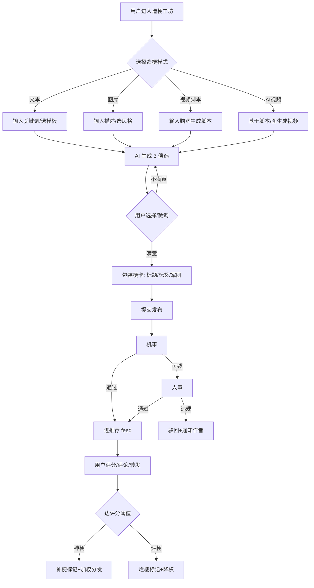
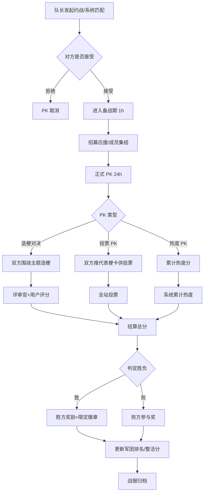
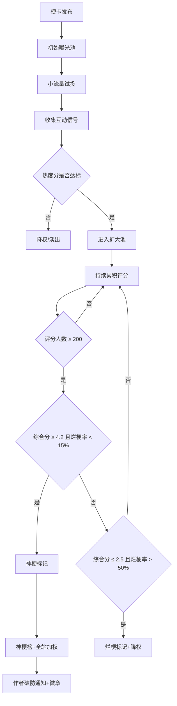

# 「梗星球」PRD —— 年轻人"梗"文化聊天平台 + 内容社区

> 内部产品需求文档（PRD） · 请勿外传

---

## 1. 文档信息

| 项目 | 内容 |
| --- | --- |
| 产品名称 | 梗星球（MemeChatAI，内部代号 `MEME-X`） |
| 文档版本 | v1.1.0（技术选型对齐版） |
| 作者 | 产品中心 / 社区产品组 |
| 创建日期 | 2026-07-06 |
| 当前状态 | 评审中（待 RTL 评审、合规评审；技术选型已对齐） |
| 评审人 | 产品负责人、技术负责人、算法负责人、内容安全、运营负责人 |
| 关联文档 | 视觉规范 v1.0、社区治理白皮书、AI 内容生成合规指引、数据埋点字典 v1.0、[TechnicalDesign.md](./TechnicalDesign.md) v1.1.0 |
| 变更记录 | 2026-07-06 首版创建；2026-07-07 v1.1 新增"造梗 Agent"（Pro 专属）、视频模型定稿豆包 Seedance 2.0 mini、视频配额调整为免费 1次/周·Pro 3次/日、Pro 定价定稿 ¥18 + 视频按次包、数据部署定稿国内自建 PG、AIGC 备案定稿为上线 gate、客户端路线对齐 RN+Expo(MVP)→Flutter(v2.0 候选) |

---

## 2. 产品概述

### 2.1 产品定位

**一句话定位**：
> 「梗星球」是一个用 AI 帮年轻人造梗、拍梗、聚梗、PK 梗的聊天式内容社区——让每一个"整活脑洞"都能 30 秒变成可传播的梗作品，让每一群"同好"都能组队干仗。

**一段话定位**：
梗星球以"梗"（Meme）为最小内容单元，把 **AI 创作（AIGC）+ 内容评分社区 + 阵营化社交 + 实时聊天** 四件事拧成一股绳。用户在 App 内可以用 AI 一键造梗（文本/图/视频脚本）、一键生成梗视频，发布为"梗卡"进入内容流；其他用户对梗卡打分（神梗 / 烂梗）、评论、转发；用户可以加入或创建"梗大军"围绕主题聚集，军团之间发起限时造梗对决、投票 PK、热度 PK，形成持续的内容生产与对抗循环。产品本质是一个 **"AI 驱动的 Z 世代内容共创 + 社交对抗场"**。

### 2.2 目标用户画像

| 维度 | 描述 |
| --- | --- |
| 核心年龄 | 16–28 岁，重点 18–24 岁大学生 / 初入职场人群 |
| 地域分布 | 一二三线城市为主，下沉市场次核心 |
| 兴趣标签 | 梗图、整活、抽象、二次元、表情包、脱口秀、说唱、电竞、追番、短视频重度用户 |
| 行为习惯 | 日均刷短视频 >90 分钟；高频使用表情包、评论区玩梗；偏好"轻创作、强反馈、快消费"；对长文本耐心低，对"爽点/笑点/破防点"敏感 |
| 设备 | iOS / Android 双端，安卓占比预计 65%+ |
| 核心痛点 | ① 想整活但不会剪辑/不会画画/不会写段子；② 想找人一起玩梗但微信群太分散、贴吧太老；③ 自己造的梗没人看、没反馈、没成就感；④ 现有社区"看的多、玩的少"，缺对抗性和归属感 |
| 付费意愿 | 中低，但对"个性装扮、军团徽章、专属梗模板、AI 高级生成额度"有情绪付费意愿 |

### 2.3 用户价值 & 商业价值

**用户价值**
- **创作平权**：AI 把"造梗"门槛从"会剪辑+会PS+会写段子"降到"会打字 + 选模板"，让 80% 的"沉默观众"变成"轻度创作者"。
- **社交归属**：梗大军提供"战队式"归属感，把"一个人刷视频"变成"一群人一起整活"。
- **情绪价值**：神梗/烂梗评分 + 军团 PK 制造"赢的爽 / 输的不服"的情绪过山车，提升停留与回访。

**商业价值**
- **流量价值**：高娱乐性 + 对抗性内容天然适合裂变，预期分享率（share/post）高于普通 UGC 社区。
- **变现路径**：① AI 生成额度订阅（Pro 会员）；② 军团装扮 / 徽章 / 头像框等虚拟资产；③ 信息流原生广告（以"梗卡"形式原生植入）；④ 品牌方"梗营销"投放（品牌赞助 PK、品牌梗模板）；⑤ 创作者激励分成生态。
- **数据资产**：积累"梗偏好图谱 + AIGC prompt 库"，反哺模型与广告精准度。

### 2.4 竞品分析

| 竞品 | 核心定位 | 优势 | 短板 | 与梗星球的差异 |
| --- | --- | --- | --- | --- |
| **最右 / 皮皮虾** | 段子/神评社区 | 段子文化沉淀深、用户调性明确 | 创作门槛高、缺 AIGC、无阵营对抗、产品形态老旧 | 我们用 AI 降低创作门槛 + 军团 PK 重做社交层 |
| **抖音** | 短视频泛娱乐 | 流量、算法、生态最强 | 创作门槛高、社区关系弱、梗是"副产品"不是"主商品" | 我们把"梗"作为一等公民，有评分/军团/PK 体系 |
| **B 站** | Z 世代 PGC/UGC 视频社区 | 社区文化强、弹幕氛围 | 创作门槛高、梗分散在视频里无独立单元、无对抗玩法 | 我们以"梗卡"为原子单元，轻量、强对抗、强 AIGC |
| **小红书** | 生活方式社区 | 种草心智、女性用户、商业化好 | 调性偏生活方式、无梗文化基因、无 AIGC 主链路 | 完全不同赛道，差异化明显 |
| **即梦 / 可灵（字节 AIGC）** | AI 图片/视频生成工具 | 模型能力强、生成质量高 | 是"工具"不是"社区"，无社交/对抗/评分闭环 | 我们是"工具 + 社区 + 对抗"三合一，工具部分可复用其模型能力 |
| **Discord / QQ 频道** | 兴趣社群聊天 | 社群运营成熟 | 无内容沉淀、无 AIGC、无对抗玩法 | 我们把"聊天"和"梗内容"绑定，让聊天产生内容 |

### 2.5 核心差异点 / 护城河

1. **以"梗卡"为原子单元的评分体系**：业内首个把"梗"独立成可评分、可排名、可对抗的内容对象，形成独有的"神梗/烂梗"心智。
2. **AIGC 全链路内置**：从"想梗 → 写脚本 → 生成图/视频 → 配音字幕 → 发布"在 App 内闭环，外部工具无法形成这种体验连贯性。
3. **军团化对抗社交**：把"兴趣社群"升级为"有敌人的战队"，引入限时 PK、投票对决、热度排行榜，制造天然的回访理由与情绪投入。
4. **AI 模型 + 梗偏好数据飞轮**：用户评分（神/烂）+ 转发 + 评论构成大规模 RLHF 信号，反哺专属"造梗模型"，越用越懂年轻人的"梗审美"，形成数据护城河。
5. **氛围调性**：产品文案、视觉、运营策略全部按"抽象 / 整活 / 破防"调性打磨，避免变成"又一个泛娱乐短视频 App"。

---

## 3. 核心概念与术语表

| 术语 | 定义 |
| --- | --- |
| **梗（Meme）** | 一个可传播的"笑点 / 段子 / 图 / 短视频"单元，是产品的最小内容对象。 |
| **梗卡（Meme Card）** | 梗在产品中的标准承载形态，包含封面（图/视频/纯文本卡）、标题、作者、评分、军团归属、互动数据等字段。 |
| **造梗（Meme Creation）** | 用户使用 AI 工具产出新梗的过程，包含文本造梗、图片造梗、视频脚本造梗、视频生成等。 |
| **神梗（God Meme）** | 评分体系中综合得分 ≥ 阈值且互动达标的梗卡，进入神梗榜、获得额外分发加权。 |
| **烂梗（Trash Meme）** | 评分低于阈值的梗卡，分发降权，连续烂梗会触发创作者提示（非处罚）。"烂梗"在产品语境中带戏谑感，非贬义。 |
| **梗大军（Meme Legion）** | 用户自发或官方组织的"战队 / 阵营"，围绕主题、风格、人物、IP 聚集，有队长、成员、等级、贡献度。 |
| **大军队长（Legion Leader）** | 军团的创建者/管理者，可设置军团规约、审核成员、报名 PK。 |
| **梗评审官（Meme Judge）** | 通过社区贡献度竞选产生的资深用户，拥有评分加权权、可参与官方 PK 评审。 |
| **PK（Legion Battle）** | 两个或多个梗大军之间的限时对抗玩法，含造梗对决、投票对决、热度对决三种主类型。 |
| **梗力值（Meme Power）** | 用户的综合创作能力分，由历史梗卡评分、PK 贡献、活跃度综合计算，影响生成额度与等级。 |
| **梗能量（Meme Energy）** | 用户每日恢复的"造梗体力"，每次 AI 生成消耗一定能量，引导轻度消费 + 付费购买。 |
| **破防值** | 互动行为（被神评、被转发、被军团收录）累积的情绪型指标，用于勋章与等级展示。 |
| **整活分** | 军团的综合活跃度分，决定军团等级与 PK 匹配池。 |

---

## 4. 用户角色与使用场景

### 4.1 角色定义

| 角色 | 描述 | 关键权限 |
| --- | --- | --- |
| **游客** | 未登录用户 | 仅可浏览推荐流，不可发布/评分/加入军团 |
| **普通用户（吃瓜群众）** | 已注册用户 | 浏览、评分、评论、转发、加入军团（≤3 个）、私聊 |
| **创作者（造梗人）** | 发布过 ≥3 张梗卡的用户 | AI 造梗工坊全功能、可申请评审官 |
| **大军队长** | 军团创建者 | 军团管理、成员审核、报名 PK、军团主页装扮 |
| **军团成员** | 加入军团的用户 | 参与军团群聊、参与 PK、获得军团装扮 |
| **梗评审官** | 社区竞选的资深用户 | 评分加权 1.5x、参与官方 PK 评审、举报优先处理 |
| **官方运营** | 平台员工 | 后台审核、PK 运营、榜单运营、数据看板 |

### 4.2 典型用户故事（User Stories）

> **US-1（造梗）**：作为一个天天刷到神梗但自己不会做的大学生，我希望用 AI 把我脑子里的"如果 XX 会怎样"的脑洞 30 秒变成一张梗卡发出去，让网友给我打分，这样我也能体验当"梗主"的快乐。

> **US-2（评分）**：作为一个资深吃瓜群众，我希望看到一个"烂梗预警"标签让我快速跳过烂梗，同时能给我认可的神梗打 5 星并转发到微信群，这样我能在朋友圈维持"梗王"人设。

> **US-3（军团）**：作为一个"抽象派"梗爱好者，我希望加入一个全是抽象兄弟的梗大军，每天在军团群里聊天造梗，这样我不再是一个人刷视频，而是有一群"同好"一起整活。

> **US-4（PK）**：作为一个梗大军队长，我希望主动向另一个军团发起 24 小时造梗对决 PK，赢的军团上榜并获得限定徽章，这样能激励我的成员更活跃，也让军团有荣誉感。

> **US-5（视频生成）**：作为一个不会剪辑但脑子里有剧本的玩家，我希望把我的梗脚本一键生成 15 秒带配音字幕的短视频，这样我能直接发到梗星球 feed 也能下载发抖音。

> **US-6（评审官）**：作为一个长期产出神梗的创作者，我希望成为评审官，让我的一票比普通用户权重更高，这样我有更强的社区荣誉感和参与感。

> **US-7（聊天）**：作为军团成员，我希望在军团群聊里直接 @ 队长发起一个内部造梗小比赛，让群里冷场时立刻有玩法，这样群活跃度不会掉。

---

## 5. 功能模块详细设计

> 通用约定：每个模块给出「功能描述 / 核心流程 / 关键交互 / 规则 / 字段 / MVP 划分」。

### 模块 1：用户系统

**功能描述**
- 注册登录：手机号一键登录 + 第三方（微信 / Apple / QQ）授权；新用户强制选择 3–5 个"梗兴趣标签"做冷启推荐。
- 个人主页：头像、昵称、签名、梗力值、破防值、所属军团、勋章墙、梗卡作品 Tab、神梗合集 Tab、被评分分布。
- 成长体系：等级 = f(梗力值)，等级影响 AI 生成额度、装扮解锁、评审官资格。
- 勋章：成就型（首张神梗、连续 7 天造梗、PK 冠军队成员）+ 装扮型（付费/活动获取）。

**核心流程**
1. 启动 → 一键登录 → 兴趣标签选择 → 冷启 feed 加载。
2. 个人主页 → 编辑资料 → 选择军团展示 → 勋章墙。

**关键交互**
- 昵称支持 emoji 与特殊符号（贴合年轻人），但触发敏感词过滤。
- 头像支持静态图 + GIF（VIP 解锁动态头像框）。
- 等级进度条以"梗力值进度"展示，文案带梗（如 "Lv.5 路人甲 → Lv.6 整活新秀"）。

**规则**
- 一个用户最多同时加入 3 个军团（避免叛变刷资源）。
- 昵称 30 天可改 1 次，防止冒充。
- 等级降级机制：连续 30 天无任何互动行为，梗力值每周衰减 5%。

**关键字段**
`user_id, nickname, avatar, gender, birthday, interest_tags[], level, meme_power, defense_value, legion_ids[], badges[], created_at, status`

**MVP vs 完整版**
- MVP：手机号登录、基础主页、等级、3 个勋章。
- 完整版：动态头像、装扮系统、等级衰减、勋章商店、成长任务体系。

---

### 模块 2：AI 造梗工坊

**功能描述**
提供 4 种造梗模式 + Pro 专属 Agent 模式：
- **文本造梗**（单次 prompt 模式，全用户）：输入"主题/关键词/情境"，AI 生成 3 条候选段子，可选风格（抽象 / 阴阳 / 谐音 / 反转 / 谐谑）。
- **图片造梗**：基于文本描述生成梗图，支持"表情包风格 / 写实风格 / 二次元风格 / 油画恶搞风格"。
- **视频脚本造梗**：输入脑洞，AI 输出 15s/30s 短视频脚本（分镜 + 台词 + 配音建议）。
- **Prompt 模板库**：官方 + UGC 模板，一键套用，"换主角不换结构"。
- **🆕 造梗 Agent 模式（Pro 专属）**：AI 多步推理自动产出"高质量梗"，流程为"RAG 检索历史神梗 → 生成 3 候选 → 自评打分选最优"，质量显著优于单次 prompt。详见技术设计 §8.6。

**核心流程**
- **单次 prompt 模式（全用户）**：进入工坊 → 选模式 → 输入关键词 / 选模板 → 选风格 → AI 生成 3 候选 → 用户挑选/微调 → 进入"梗卡包装" → 发布。同步返回，3-5s。
- **Agent 模式（Pro 专属）**：进入工坊 → 切换到"Agent 模式" → 输入主题 → 提交后进入异步任务（15-30s）→ 用户可退出工坊，完成后推送通知 → 重新进入查看"最优候选 + 备选 2 条" → 微调 → 发布。

**关键交互**
- 生成结果以"卡牌盲盒"形式呈现，提升仪式感。
- 支持对单条候选"再来一次"或"在此基础上变体"。
- 风格选择带预览样图，降低决策成本。
- 每次生成消耗"梗能量"，能量不足时引导观看激励视频或开通 Pro。
- **Agent 模式**：进度条带"脑细胞燃烧中…Agent 正在检索全网神梗"等趣味文案；完成后系统通知"你的神梗已就位，速来验收"。

**规则**
- 单次 prompt 模式：单次生成耗时上限 30s，超时降级提示。
- Agent 模式：单次耗时上限 60s，超时/失败自动降级为单次 prompt 模式返回 3 候选，并退回 Agent 能量。
- 同一 prompt 24h 内生成结果去重，避免抄袭自己。
- **Agent 配额**：Pro 会员 10 次/日，免费用户不可用（v1.5 全用户开放）。
- 用户对生成内容拥有使用权，平台拥有展示与训练权（详见合规条款）。

**关键字段**
`creation_id, user_id, mode(text/image/script), prompt, style, template_id, candidates[], chosen_candidate, energy_cost, model_version, created_at, agent_mode(bool), agent_job_id, agent_steps[]`

**MVP vs 完整版**
- MVP：文本造梗（单次 prompt）+ 图片造梗 + 5 个官方模板 + **Pro 专属 Agent 模式（3 步精简版）**。
- 完整版：视频脚本造梗、UGC 模板库、Prompt 微调高级模式、风格自定义、Agent 全用户开放 + 视频脚本生成步。

---

### 模块 3：AI 梗视频生成

**功能描述**
- **文生视频**：基于文本/脚本生成 5–15s 短视频。
- **图生视频**：基于已生成的梗图做动态化。
- **配音**：多音色 TTS（搞怪音、东北音、御姐音、机器人音等）。
- **字幕**：自动生成 + 手动编辑。
- **时长限制**：MVP 仅支持 5s / 10s / 15s 三档。
- **审核**：生成完成后异步送审，审核通过才可发布。

**核心流程**
1. 选择"生成视频"入口 → 来源（文本/脚本/图）→ 选择时长与音色 → 生成 → 预览 → 编辑字幕 → 提交审核 → 发布为梗卡。

**关键交互**
- 生成进度条带"造梗中…脑细胞燃烧 78%"等趣味文案。
- 预览页可"一键换音色"重新生成配音。
- 视频生成失败时退回能量并赠送一次补偿生成。

**规则**
- 视频生成成本高，单次能量消耗 = 图片造梗的 5 倍。
- **配额（v1.1 已与技术对齐定稿）**：
  - **免费用户**：默认走"图片 + TTS + Ken Burns 动效"兜底（体验接近真视频，成本 1/10），每周赠 1 次真视频额度（需完成任务解锁，如评分 3 张梗卡）。
  - **Pro 会员**：豆包 Seedance 2.0 mini 真视频 **3 次/日**（5s 默认），高梗力值用户可解锁 Seedance 2.0 标准版（5s/10s）。
- 视频默认带"AI 生成"水印（合规要求）。
- 免费额度紧张时，"视频"可能降级为"图片 + TTS 配音 + Ken Burns 动效"的伪视频体验（成本仅 1/5），用户可加能量等待真视频。
- **MVP 灰度阶段**：DAU ≤ 500~2000 邀请制，控豆包成本；全量上线视成本看板决定。

**关键字段**
`video_id, source_type, source_id, duration, voice_id, subtitle_text, status(generating/reviewing/published/rejected), model_version, file_url, cover_url`

**MVP vs 完整版**
- MVP：文生视频 5/10/15s + 4 种音色 + 自动字幕。
- 完整版：图生视频、自定义音色克隆（合规评审通过后）、BGM 库、剪辑时间线高级模式。

---

### 模块 4：梗卡内容流

**功能描述**
- **发布**：从工坊/视频生成结果包装为梗卡，含封面、标题、标签、归属军团（可选）。
- **推荐 feed**：双列瀑布流（图/纯文本卡）+ 单列沉浸式（视频卡）混合。
- **互动**：评分（1–5 星）、评论（含神评系统）、转发（站内 + 站外）、收藏、举报。
- **热度算法**：见第 8 章。

**核心流程**
1. 工坊产出 → 包装梗卡 → 选标签 → 选军团 → 发布 → 审核 → 进 feed。
2. 浏览 feed → 评分 / 评论 / 转发 → 行为反馈到推荐算法。

**关键交互**
- 梗卡封面带"评分徽章"（神梗金 / 烂梗灰）。
- 长按梗卡出现"快速评分弹层"（1–5 星 + 表情）。
- 下拉刷新带"今天的脑洞已就位"等文案。
- 评论支持"造梗接龙"模式：评论本身就是一张新梗卡。

**规则**
- 一张梗卡评分人数 ≥ 50 才显示综合星级，避免早期刷分。
- 烂梗标签触发后仍可在作者主页可见，但 feed 分发降权 70%。
- 转发到站外时自动带"梗星球"水印与来源链接。

**关键字段**
`meme_id, author_id, type(text/image/video), cover_url, title, tags[], legion_id, score_avg, score_count, comment_count, share_count, hot_score, status, created_at, published_at`

**MVP vs 完整版**
- MVP：发布、推荐 feed、评分、评论、转发、举报。
- 完整版：神评系统、造梗接龙、合集、话题挑战。

---

### 模块 5：梗评分与评论体系

**功能描述**
- **评分维度**：笑点（40%）+ 创意（30%）+ 传播力（30%），1–5 星。
- **评分算法**：加权平均，评审官权重 1.5x，普通用户 1.0x，新用户（<3 天）0.5x 防刷。
- **神梗/烂梗判定**：
  - 神梗：评分人数 ≥ 200 且综合分 ≥ 4.2 且烂梗率（1 星占比）< 15%。
  - 烂梗：评分人数 ≥ 200 且综合分 ≤ 2.5 且烂梗率 > 50%。
- **评审官机制**：每月从梗力值 Top 1% 且无违规的用户中竞选，任期 30 天，可连任。

**核心流程**
1. 用户评分 → 系统累计 → 达阈值触发神/烂梗判定 → 状态变更 → 影响分发与勋章。

**关键交互**
- 评分后弹出"你认为是神梗还是烂梗？"二元选择，强化调性。
- 神梗诞生时作者收到"破防通知" + 限定徽章。

**规则**
- 同一用户对同一梗卡只能评分一次，可改分（24h 内）。
- 评分后不可删除，避免操纵。
- 评审官评分需在 1h 内给出文字理由（≥10 字），否则不计加权。

**关键字段**
`score_id, meme_id, user_id, dimensions{laugh,creative,spread}, is_judge, weight, is_god_trash_vote, comment, created_at`

**MVP vs 完整版**
- MVP：单一总分（1–5 星）+ 神/烂梗判定 + 评审官。
- 完整版：三维分项、评审官竞选、烂梗博物馆、神梗殿堂。

---

### 模块 6：梗大军（Legion）

**功能描述**
- **创建**：任意 Lv.3+ 用户可创建军团，需填写名称、口号、主题标签、头像。
- **加入**：用户可申请加入，队长审批 / 公开加入两种模式。
- **军团主页**：展示军团信息、成员榜、军团梗卡墙、PK 战绩、贡献榜。
- **成员管理**：队长可设副队长、踢人（7 天冷却）、设置军团规约。
- **等级与贡献度**：
  - 军团等级 = f(整活分) ，影响军团装扮与 PK 匹配池。
  - 成员贡献度 = 个人梗卡评分 + PK 贡献 + 活跃度，影响军团内排名与分成。

**核心流程**
1. 创建军团 → 审核通过 → 招募成员 → 军团群聊 → 参与活动 / PK → 累积整活分 → 升级。

**关键交互**
- 军团头像支持"军团徽章"叠图，PK 期间有"应援边框"。
- 军团主页有"今日战报"模块：新增成员、新增梗卡、PK 进展。

**规则**
- 军团名称唯一，3–12 字，禁止敏感词与冒充官方。
- 军团解散需队长申请 + 7 天公示 + 全员同意率 ≥ 50%。
- 军团被处罚（违规）期间不能 PK。

**关键字段**
`legion_id, name, slogan, theme_tags[], leader_id, level, activity_score, member_count, member_cap, join_mode(public/approval), badges[], pk_record[], created_at, status`

**MVP vs 完整版**
- MVP：创建、加入、主页、等级、贡献度、群聊。
- 完整版：副队长权限、军团装扮商店、军团任务、军团排行榜。

---

### 模块 7：梗大军 PK

**功能描述**
PK 三大类型：
- **造梗对决**：双方在限时（如 24h）内围绕同一主题造梗，由评审官 + 用户投票评分，总分高者胜。
- **投票 PK**：双方各推 N 张代表梗卡，全站用户投票，票数高者胜。
- **热度 PK**：限时内双方所有成员梗卡累计热度分对决。

**匹配机制**
- 主动约战：队长向另一军团发起挑战，对方接受后开战。
- 系统匹配：基于军团等级 + 整活分匹配相近对手，每周自动安排一场。
- 跨段位保护：高段位军团不能挑战低 2 段以上的军团。

**PK 流程**
1. 发起/匹配 → 双方确认 → 进入备战期（1h，招募应援）→ 正式 PK（24h）→ 结算 → 排名更新 → 奖励发放。

**关键交互**
- PK 期间全站顶部有"军团大战"横幅 + 双方实时比分。
- 用户可"应援"：观看一方梗卡、评分、转发均计为应援值。
- 战斗结束有"战报"卡片，胜方限定徽章 + 整活分加成。

**规则**
- 单军团同时最多 1 场进行中 PK。
- 投票 PK 每人每天每场最多投 3 票，防刷。
- 造梗对决每方最多提交 20 张梗卡，超限自动按内部评分取 Top 20。
- PK 期间梗卡违规被下架，对应得分扣减。

**奖励**
- 胜方：军团整活分 +500、成员个人梗力值 +50、限定徽章。
- 败方：参与奖（+50 整活分），无徽章。
- MVP 选手（单场贡献最高）：专属"战神"徽章 + Pro 会员 7 天。

**状态机**
`idle → challenged → accepted → preparing → battling → judging → settled → archived`

**关键字段**
`pk_id, type, legion_a, legion_b, theme, start_at, end_at, status, score_a, score_b, winner_id, submissions_a[], submissions_b[], voters[], mvp_user_id, reward_state`

**MVP vs 完整版**
- MVP：投票 PK + 造梗对决，主动约战 + 系统匹配。
- 完整版：热度 PK、跨军团联盟战、季度锦标赛、直播解说。

---

### 模块 8：消息与聊天

**功能描述**（体现"聊天平台"属性）
- **私聊**：1v1 文本/图片/梗卡分享/语音消息。
- **军团群聊**：军团内置群，支持 @、消息引用、梗卡接龙、内部小比赛发起。
- **@ 通知**：在群聊/评论中 @ 用户触发推送。
- **系统通知**：评分、神梗、PK、奖励、违规处理等。
- **聊天互动玩法**：群内"接梗挑战"机器人，自动出题，群成员造梗接龙，优胜获军团贡献分。

**核心流程**
1. 私聊：进入会话 → 发送消息 / 分享梗卡 → 对方阅读 → 互动。
2. 群聊接梗挑战：群内点击"接梗挑战" → 机器人出题 → 成员造梗 → 群内投票 → 结算贡献分。

**关键交互**
- 输入框上方有"梗卡"快捷分享按钮，直接拉起最近浏览的梗卡。
- 群聊支持"梗表情包"专用面板（平台精选 + 用户自制）。

**规则**
- 私聊陌生人需对方通过"打招呼请求"（防骚扰）。
- 军团群聊消息保留 30 天，过期自动清理（存储成本控制）。
- 群聊发言频率限制：新成员前 24h 每分钟 ≤ 3 条。

**MVP vs 完整版**
- MVP：私聊、军团群聊、@、系统通知、梗卡分享。
- 完整版：接梗挑战机器人、语音房、AI 群聊摘要、跨军团外交群。

---

### 模块 9：个人中心与设置

**功能描述**
- 我的：梗卡作品、神梗合集、所属军团、勋章、梗力值趋势。
- 钱包：梗能量余额、Pro 会员状态、虚拟资产。
- 设置：账号安全、隐私（谁可私信/谁可看作品）、通知偏好、青少年模式、屏蔽词、注销。
- 创作者中心：作品数据看板（曝光、评分、转发、神评率）。

**MVP vs 完整版**
- MVP：我的、基础设置、青少年模式、注销。
- 完整版：创作者数据看板、钱包、Pro 会员、隐私细粒度。

---

### 模块 10：运营后台

**功能描述**
- **内容审核**：机审 + 人审，梗卡/评论/军团名称/聊天举报队列。
- **PK 运营**：官方 PK 创建、主题配置、奖励配置、异常处理。
- **数据看板**：DAU/MAU、造梗率、PK 参与率、神梗率、留存、AIGC 成本。
- **榜单运营**：神梗榜、烂梗榜、军团榜、创作者榜，人工干预与置顶。
- **运营位**：开屏、feed 顶部 banner、话题挑战配置。
- **用户管理**：封禁、解封、评审官任免、青少年模式强制开启。

**MVP vs 完整版**
- MVP：审核队列、用户封禁、基础数据看板、官方 PK 创建。
- 完整版：AB 实验平台、运营位 CMS、创作者激励结算、AI 成本告警。

---

## 6. 信息架构 & 导航

### 6.1 一级 Tab

| Tab | 名称 | 主要内容 |
| --- | --- | --- |
| 1 | **整活**（推荐 feed） | 梗卡瀑布流 / 沉浸式视频，顶部话题挑战入口 |
| 2 | **造梗**（AI 工坊） | 文本/图/视频/脚本造梗入口，Prompt 模板库 |
| 3 | **军团** | 我的军团、军团广场、PK 大厅、军团排行榜 |
| 4 | **消息** | 私聊、军团群聊、系统通知、互动通知 |
| 5 | **我的** | 个人主页、钱包、设置、创作者中心 |

### 6.2 页面层级（树形）

```
梗星球
├── 整活 (Tab1)
│   ├── 推荐 feed
│   ├── 关注 feed
│   ├── 神梗榜 / 烂梗榜
│   ├── 话题挑战
│   └── 梗卡详情页
│       ├── 评论区
│       ├── 评分面板
│       └── 转发面板
├── 造梗 (Tab2)
│   ├── 文本造梗
│   ├── 图片造梗
│   ├── 视频脚本造梗
│   ├── AI 视频生成
│   ├── Prompt 模板库
│   └── 我的作品草稿
├── 军团 (Tab3)
│   ├── 我的军团
│   │   ├── 军团主页
│   │   ├── 军团群聊
│   │   ├── 成员管理
│   │   └── PK 战绩
│   ├── 军团广场（发现/加入）
│   ├── PK 大厅
│   │   ├── 进行中
│   │   ├── 即将开始
│   │   └── 历史战报
│   └── 军团排行榜
├── 消息 (Tab4)
│   ├── 私聊会话列表
│   ├── 军团群聊列表
│   ├── 互动通知（评分/评论/转发）
│   └── 系统通知
└── 我的 (Tab5)
    ├── 个人主页
    ├── 我的作品
    ├── 创作者中心
    ├── 钱包
    └── 设置
```

---

## 7. 核心业务流程图

### 7.1 造梗发布流程



### 7.2 军团 PK 流程



### 7.3 评分上热流程



---

## 8. 推荐与排序算法（产品视角）

### 8.1 梗卡热度分公式

```
热度分 H = W1 * 评分加权分
        + W2 * log(1 + 评论数)
        + W3 * log(1 + 转发数)
        + W4 * log(1 + 完播率/查看率)
        + W5 * 时间衰减因子
        + W6 * 军团 PK 加成
        - W7 * 烂梗惩罚
```

**建议权重（v1.0，后续 AB 调优）**：

| 因子 | 权重 | 说明 |
| --- | --- | --- |
| W1 评分加权分 | 0.30 | 综合分 * log(1+评分人数)，避免少量高分刷分 |
| W2 评论数 | 0.15 | 评论代表深度参与 |
| W3 转发数 | 0.25 | 转发是最强传播信号 |
| W4 完播/查看率 | 0.15 | 视频卡看完播率，图文卡看停留 |
| W5 时间衰减 | 0.10 | exp(-t/半衰期)，半衰期 12h |
| W6 军团 PK 加成 | 0.05 | PK 期间 +20% 加成 |
| W7 烂梗惩罚 | 0.10 | 烂梗标记后扣分 |

### 8.2 评分权重

- 普通用户：1.0x
- 评审官：1.5x
- 新用户（<3 天）：0.5x
- 同军团成员给本军团梗卡评分：0.8x（防抱团，但不完全屏蔽，保留社交属性）

### 8.3 个性化推荐因子

| 因子 | 说明 |
| --- | --- |
| 兴趣标签匹配 | 用户兴趣 vs 梗卡标签的向量相似度 |
| 行为偏好 | 偏好视频/图/文本、偏好风格（抽象/二次元/写实） |
| 社交关系 | 关注、同军团、近期互动对象的作品加权 |
| 军团 PK 上下文 | PK 期间相关军团梗卡加权 |
| 多样性 | 同一作者/同一军团/同一风格在单屏内不超过 30% |
| 新鲜度 | 24h 内新梗基础加权，避免老梗长期霸榜 |
| 神梗加权 | 神梗 +30% 基础曝光 |
| 烂梗降权 | 烂梗 -70% 曝光 |

---

## 9. 内容安全与社区治理

### 9.1 审核策略

| 内容类型 | 审核方式 | SLA |
| --- | --- | --- |
| 梗卡（文本/图/视频） | 机审前置 + 可疑人审 | 机审 < 30s，人审 < 30min |
| 评论 | 机审为主 + 举报触发人审 | 机审实时 |
| 军团名称/口号 | 创建时人审 | < 2h |
| 私聊/群聊 | 机审 + 关键词 + 举报 | 实时 |
| AI 生成内容 | 生成时模型侧过滤 + 发布时二次审核 | 同上 |

### 9.2 违规处理

| 等级 | 行为 | 处理 |
| --- | --- | --- |
| L1 | 轻微低俗/引战 | 内容删除 + 警告 |
| L2 | 中度违规（色情擦边/人身攻击） | 内容删除 + 禁言 7 天 |
| L3 | 重度违规（违法/涉政/未成年人不良导向） | 永久封号 + 上报 |
| 军团违规 | 军团纵容违规内容 | 军团降级 + 暂停 PK 资格 |

### 9.3 青少年模式

- 识别：实名年龄 < 18 或主动开启。
- 限制：每日使用时长 ≤ 40min，22:00–6:00 不可用，不可发布/评分/私信/加入军团。
- 内容：仅展示精选正能量内容，屏蔽 AI 视频生成。

### 9.4 敏感词与 AI 生成内容标识

- 敏感词库：政治、色情、暴恐、诈骗、未成年人保护等多分级词库，机审 + 人工更新。
- AI 生成内容标识：所有 AI 生成的梗卡与视频默认带"AI 生成"角标 + 梗卡详情页"由 AI 辅助创作"声明，符合《生成式 AI 服务管理办法》要求。
- 深度合成：人脸/声音相关生成需通过额外合规校验，MVP 不开放人脸/声音克隆。

---

## 10. 数据指标体系

### 10.1 北极星指标

> **日均"有效造梗"数（Daily Effective Meme, DEM）** = 每日发布的、被至少 50 人评分的梗卡数量。
> 理由：同时反映"创作活跃度"和"内容质量"，避免单纯刷量。

### 10.2 核心指标

| 维度 | 指标 | 目标（v1.0 上线 3 个月） |
| --- | --- | --- |
| 规模 | DAU / MAU | DAU 50w / MAU 300w |
| 活跃 | 造梗率（日造梗用户/DAU） | ≥ 15% |
| 活跃 | PK 参与率（PK 期间活跃用户/DAU） | ≥ 30% |
| 留存 | 次日留存 / 7 日留存 / 30 日留存 | 45% / 25% / 15% |
| 质量 | 神梗率（神梗/总梗卡） | ≥ 5% |
| 质量 | 评分参与率（评分用户/DAU） | ≥ 40% |
| 社交 | 军团加入率 | ≥ 35% DAU |
| 商业 | Pro 付费率 | ≥ 2% |
| 成本 | 单用户 AIGC 成本（日） | ≤ 0.3 元 |

### 10.3 关键埋点事件

| 事件名 | 触发时机 | 关键属性 |
| --- | --- | --- |
| `app_launch` | 启动 | 冷热启、渠道 |
| `login_success` | 登录成功 | 方式、新/老用户 |
| `meme_create_start` | 进入造梗工坊选模式 | mode |
| `meme_create_success` | AI 生成成功 | mode, style, energy_cost, latency |
| `meme_publish` | 梗卡发布成功 | meme_id, type, has_legion |
| `meme_view` | 梗卡曝光且停留 ≥ 1s | meme_id, source(feed/共享) |
| `meme_score` | 用户评分 | meme_id, score, is_judge |
| `meme_comment` | 评论 | meme_id, comment_len |
| `meme_share` | 转发 | meme_id, channel(站内/站外) |
| `legion_join` | 加入军团 | legion_id |
| `pk_enter` | 进入 PK 大厅 | pk_id |
| `pk_vote` | PK 投票 | pk_id, legion_id |
| `pk_create` | 发起 PK | pk_id, type, challenger |
| `chat_send` | 发送消息 | type(私聊/群聊), msg_type |
| `god_meme_trigger` | 神梗判定 | meme_id |
| `trash_meme_trigger` | 烂梗判定 | meme_id |
| `pro_subscribe` | 订阅 Pro | plan, price |

---

## 11. MVP 范围定义

### 11.1 MVP（v1.0）必须包含

- 用户系统：手机号登录、兴趣标签、基础主页、等级、3 个勋章。
- AI 造梗：文本 + 图片 + 5 个官方模板 + **Pro 专属造梗 Agent（3 步精简版）**。
- AI 视频：文生视频 5/10/15s + 4 音色 + 自动字幕，配额免费 1 次/周（兜底图片+TTS）·Pro 3 次/日，豆包 Seedance 2.0 mini 主力。
- 梗卡 feed：发布、推荐、评分、评论、转发、举报。
- 评分体系：单一总分 + 神/烂梗判定 + 评审官。
- 梗大军：创建、加入、主页、等级、贡献度、群聊。
- PK：投票 PK + 造梗对决，主动约战 + 系统匹配。
- 消息：私聊、军团群聊、@、系统通知、梗卡分享。
- 设置：基础设置、青少年模式、注销。
- 后台：审核队列、用户封禁、基础数据看板、官方 PK。
- **商业化**：Pro 会员（月费 ¥18 起，承载 Agent 与视频高配额）+ 视频按次包（¥9.9/10次、¥29.9/50次）对冲豆包成本，MVP 即开微信支付。
- **合规**：M1 启动生成式 AI 服务备案，M3 上线前取得备案号（上线 gate）。

### 11.2 优先级表

| 优先级 | 功能 | 版本 |
| --- | --- | --- |
| **P0** | 手机号登录、兴趣标签、推荐 feed、文本/图片造梗、梗卡评分/评论/转发、神/烂梗判定、军团创建/加入/群聊、投票 PK、私聊、青少年模式、审核后台 | v1.0 MVP |
| **P0** | AI 视频生成（文生，免费 1/日·Pro 10/日）、造梗对决 PK、评审官机制、数据看板、**Pro 会员 + 造梗 Agent（Pro 专属 3 步版）**、RAG 造梗知识库 | v1.0 MVP |
| **P1** | 视频脚本造梗、Prompt 模板库（UGC）、神评系统、军团排行榜、创作者数据看板、**Agent 全用户开放 + 视频脚本生成步 + LLM-as-Judge 预评分**、**PK ELO/MMR 配对** | v1.5 |
| **P1** | 图生视频、动态头像、装扮商店、军团任务、烂梗博物馆/神梗殿堂 | v1.5 |
| **P2** | 热度 PK、跨军团联盟战、季度锦标赛、接梗挑战机器人、语音房、AI 群聊摘要、AB 实验平台、品牌梗营销投放 | v2.0 |
| **P2** | 音色克隆、BGM 库、高级剪辑时间线、创作者激励结算、**个性化造梗 Agent（用户长期记忆）**、**Flutter App 重写评估** | v2.0 |

---

## 12. 版本规划路线图

> 节奏假设：v1.0 立项后 3 个月上线，之后每 1.5 个月一个大版本。

| 版本 | 时间 | 核心目标 | 关键功能 |
| --- | --- | --- | --- |
| 版本 | 时间 | 核心目标 | 关键功能 |
| --- | --- | --- | --- |
| **v1.0 MVP** | M1–M3 | 跑通"造梗→评分→军团→PK"主闭环，验证留存；商业化承载就位；合规 gate 就位 | 见 11.1（含 Pro 会员 + Pro 造梗 Agent + RAG 知识库 + 视频按次包）；M1 启动 AIGC 备案，M3 取得备案号；M3 上线邀请制灰度 DAU ≤ 500~2000 控豆包成本 |
| **v1.1** | M4 | 氛围与数据驱动 | 神评系统、创作者数据看板、AB 实验框架、首批运营位 CMS |
| **v1.5** | M5–M6 | 创作升级 + 推荐进阶 | Pro Agent 全用户开放 + 视频脚本生成步 + LLM-as-Judge 预评分、装扮商店、视频脚本造梗、UGC Prompt 模板库、图生视频、军团排行榜、PK ELO/MMR 配对、LightGBM 排序 |
| **v2.0** | M7–M9 | 对抗玩法升级 + 社交深化 | 热度 PK、联盟战、季度锦标赛、接梗挑战机器人、语音房、AI 群聊摘要、品牌梗营销、个性化造梗 Agent、Flutter App 重写评估 |
| **v2.5+** | M10+ | 生态化 | 创作者激励分成、第三方模型接入、海外版本探索、IP 联动 |

---

## 13. 风险与开放问题

### 13.1 风险

| 风险 | 等级 | 应对 |
| --- | --- | --- |
| AIGC 成本失控 | 高 | 设能量机制 + 日生成上限 + 成本看板告警；模型侧混合大小模型 |
| 内容合规（AI 生成涉政/色情） | 高 | 双重审核（生成侧 + 发布侧）+ 人工抽检 + 应急熔断 |
| 社区氛围走向低俗 | 高 | 调性运营 + 神梗激励机制 + 烂梗标记不删（保留戏谑感但降权）|
| 军团抱团刷分 | 中 | 同军团评分降权 + 评审官轮换 + 异常检测 |
| 冷启动内容不足 | 中 | 官方种子军团 + 内测创作者激励 + 话题挑战 |
| PK 玩法过度对抗引战 | 中 | 战斗文案带"友好戏谑"调性 + 跨段位保护 + 举报通道 |
| AI 视频生成质量不达预期 | 中 | MVP 仅 5–15s + 限定风格 + 失败补偿 |

### 13.2 开放问题（需进一步确认）

1. ✅ **AI 模型来源**（已对齐）：不自研，接入 DeepSeek V3（文本主力）+ GLM-4 Flash（免费兜底）+ SiliconFlow FLUX（图像）+ **字节豆包 Seedance 2.0 mini（视频 MVP 主力）**/ Seedance 2.0 标准版（Pro 高端）/ SiliconFlow·即梦 fallback。详见 TechnicalDesign §4.5–4.7。
2. ✅ **Pro 会员定价**（已定稿）：月费 **¥18** 起，承载 Agent + 视频高配额；同步上线视频按次包（¥9.9/10次、¥29.9/50次）对冲豆包成本。年费/季费后续视转化数据再定。
3. **军团数量上限**：MVP 阶段全网军团数量是否设上限（如 1000 个）以控制运营成本？
4. **评审官规模**：评审官占活跃用户比例（建议 0.5%–1%）？任期与罢免机制？
5. **站外分享策略**：是否允许梗视频下载无水印分享到抖音/微信（更利于裂变但损失站内流量）？折中方案是"带梗星球角标"。
6. **未成年人合规**：青少年模式是否需要强制实名？是否需要家长托管？
7. **冷启动种子内容**：是否邀请一批内测 KOL 创作者？激励预算多少？
8. **PK 奖励的虚拟 vs 实物**：MVP 是否只发虚拟徽章，还是包含 Pro 会员天数？
9. **聊天是否支持陌生人社交**：是否做"梗友匹配"功能？涉及陌生人社交合规风险。
10. **品牌广告接入时机**：v1.0 是否就接入品牌梗营销，还是 v2.0 再开放？
11. ✅ **Pro 会员 + Agent 落地节奏**（已对齐）：Pro 会员与 Pro 造梗 Agent 均在 v1.0 MVP 上线（Agent 限 Pro、3 步精简版、10 次/日硬配额 + 日预算熔断）；v1.5 全用户开放。详见 TechnicalDesign §8.6。
12. ✅ **视频模型与配额**（已对齐）：MVP 主力字节豆包 Seedance 2.0 mini，Pro 高端 Seedance 2.0 标准版，SiliconFlow/即梦 fallback；配额免费 1 次/周（+图片TTS兜底）·Pro 3 次/日；MVP 灰度 DAU ≤ 500~2000 控成本。
13. ✅ **数据部署**（已对齐）：主数据国内自建 PG（含 pgvector），Supabase 仅做 Auth + Realtime。
14. ✅ **AIGC 备案**（已对齐）：MVP 上线前必须完成生成式 AI 服务备案，M1 启动 M3 取得备案号，作为上线 gate。
15. **视频兜底体验可接受性**：免费用户默认"图片+TTS+Ken Burns"伪视频（覆盖率 40-60%），是豆包成本可控的关键前提，需产品确认接受。

---

> 本 PRD 为 v1.1 立项版（技术选型已对齐），待评审通过后进入详细设计阶段。各模块详细交互稿、视觉稿、技术方案将在评审通过后由对应同学产出。
